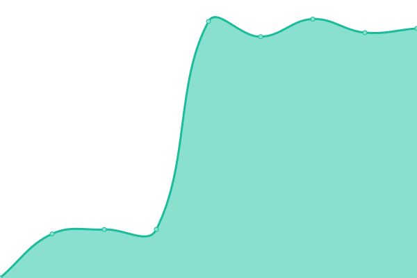

# [📈 Live Status](https://cappuccino.ovh): <!--live status--> **🟩 All systems operational**

This repository contains the open-source uptime monitor and status page for [Geno](https://cappuccino.ovh), powered by [Upptime](https://github.com/upptime/upptime).

With [Upptime](https://upptime.js.org), you can get your own unlimited and free uptime monitor and status page, powered entirely by a GitHub repository. We use [Issues](https://github.com/gabrielegenovese/cappuccino-uptime/issues) as incident reports, [Actions](https://github.com/gabrielegenovese/cappuccino-uptime/actions) as uptime monitors, and [Pages](https://cappuccino.ovh) for the status page.

<!--start: status pages-->
<!-- This summary is generated by Upptime (https://github.com/upptime/upptime) -->
<!-- Do not edit this manually, your changes will be overwritten -->
<!-- prettier-ignore -->
| URL | Status | History | Response Time | Uptime |
| --- | ------ | ------- | ------------- | ------ |
|  [Host: cappuccino](https://test.cappuccino.ovh) | 🟩 Up | [host-cappuccino.yml](https://github.com/gabrielegenovese/cappuccino-uptime/commits/HEAD/history/host-cappuccino.yml) | 

 283ms
     
 | 

<a href="https://uptime.cappuccino.ovh/history/host-cappuccino">94.58%</a>
    

|  [Immich](https://photos.cappuccino.ovh) | 🟩 Up | [immich.yml](https://github.com/gabrielegenovese/cappuccino-uptime/commits/HEAD/history/immich.yml) | 

 763ms
     
 | 

<a href="https://uptime.cappuccino.ovh/history/immich">96.08%</a>
    

|  [NextCloud](https://cloud.cappuccino.ovh) | 🟩 Up | [next-cloud.yml](https://github.com/gabrielegenovese/cappuccino-uptime/commits/HEAD/history/next-cloud.yml) | 

 1081ms
     
 | 

<a href="https://uptime.cappuccino.ovh/history/next-cloud">96.10%</a>
    

|  [Matrix](https://matrix.cappuccino.ovh) | 🟩 Up | [matrix.yml](https://github.com/gabrielegenovese/cappuccino-uptime/commits/HEAD/history/matrix.yml) | 

 725ms
     
 | 

<a href="https://uptime.cappuccino.ovh/history/matrix">96.35%</a>
    

|  [Jellyfin](https://jellyfin.cappuccino.ovh) | 🟩 Up | [jellyfin.yml](https://github.com/gabrielegenovese/cappuccino-uptime/commits/HEAD/history/jellyfin.yml) | 

 818ms
     
 | 

<a href="https://uptime.cappuccino.ovh/history/jellyfin">96.15%</a>
    

|  [Jellyseerr](https://jellyseerr.cappuccino.ovh) | 🟩 Up | [jellyseerr.yml](https://github.com/gabrielegenovese/cappuccino-uptime/commits/HEAD/history/jellyseerr.yml) | 

 1487ms
     
 | 

<a href="https://uptime.cappuccino.ovh/history/jellyseerr">96.17%</a>
    

|  [Grocy](https://grocy.cappuccino.ovh) | 🟩 Up | [grocy.yml](https://github.com/gabrielegenovese/cappuccino-uptime/commits/HEAD/history/grocy.yml) | 

 1166ms
     
 | 

<a href="https://uptime.cappuccino.ovh/history/grocy">91.31%</a>
    

<!--end: status pages-->

[**Visit our status website →**](https://cappuccino.ovh)

## 📄 License

- Powered by: [Upptime](https://github.com/upptime/upptime)
- Code: [MIT](./LICENSE) © [Anand Chowdhary](https://anandchowdhary.com), supported by [Pabio](https://pabio.com)
- Data in the `./history` directory: [Open Database License](https://opendatacommons.org/licenses/odbl/1-0/)
